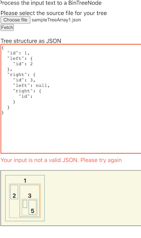
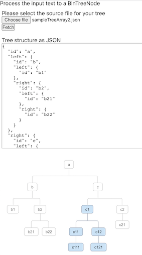

## Problem 1

### BinTreeNode changes
A few small changes to the [BinTreeNode](./src/TreeNode.ts) class were needed.
Since the PDF did not show children nodes when they are both `null`, 

I have added a piece of code to handle that in the constructor, so the properties `left` and `right` are only created when at least one of them exists. However, for that to work, I had to make both properties (`left` and `right` as optional (e.g `left?:`))

### TreeInput changes
Most of the changes to address Problem #1 are in this file.

* `parseArrayToTree`
    
    We're reading the input array (`arrayFormat`), and we consider that:
    ```
    [0] = root (First position)
    [1] = left (Second position)
    [2] = right (Third position)
    ```
    However, since the `left` and `right` may also represent a "sub-tree", we check whether they're an array using the built-in method for that `Array.isArray()`, and if that's the case the method `parseArrayToTree` is called recursevily to build the tree structure.

* `convert`

    We parse the input received (Either as text or as the file input) using `JSON.parse()`, and if that input is correct we update the `state.treeText` value with the tree object as JSON.

    However, I noticed that the result was not displayed nicely to the user, so I decided to create a new method in a new file [Utils.ts](./src/Utils.ts), this method is named `prettyPrint`, and it is very simple, it receives a `BinTreeNode` object and it returns a string representing the JSON nicely formatted for the user.


## Problem 2

### TreeInput changes

* Form

    I started by updating the form and creating an `<input type="file"/>` field, that would later be used to upload/read the file selected by the user. We're using the `accept` parameter to filter for only `.json` files.
    This input also has its own `onChange` call back (`changeFileHandler`), and this is the function which updates the state (`fileInput`) value, so we can keep track of the file selected by the user.

    We also needed a new button to this form, so the user could click to parse the file selected above. For that I added a new button with a "`onClick={this.loadAndReadFile}`" call.

    The `this.state.treeText` is connected to the `<textarea>` element on the form, so once this value has been updated, we update the textarea for the user as well.

* State

    Added a new piece of information to the state, it is named as `fileInput` and it represents the file selected by the user.
    It is used by the method `changeFileHandler`

* `changeFileHandler` method

    Simple method that updates the value of the `this.state.fileInput` with the file selected by the user.

* `loadAndReadFile` method

    This method is responsible for reading the file from `this.state.fileInput` (if that's available), and update the `this.state.treeInput` with its value. After that it calls the method `convert`, which will do the rest of the job, e.g Read the tree input, parse it and update the textarea.
    
    To read the file selected, I am using the native JS [Web API - FileReader](https://developer.mozilla.org/en-US/docs/Web/API/FileReader), it accepts a `onload` callback, where I can update the state of the page.

* Manually editing the tree source

    Since we would like to edit the tree source manually, I have attached a listener for changes in the `<textarea>` element, this is called `onChangeTreeText`
    
    This method receives the current text from the `<textarea>`, we update the `treeText` state value, and call the method to draw the Tree UI again if the input is valid.

* Handling invalid input information

    The user can edit the JSON manually, so we would like to verify that the input is correct before "drawing" the tree, also if the input is not valid we should be able to give some feedback to the user, for that I have created a new state value named `isInputValid`, it start as `true` because we assume things are fine; however, at anytime the input changes either by selecting a file, or changing the value manually we need to check if the JSON is valid (I used  a simple `try/catch` mechanism for that), in case of an error (`catch` will be called), we will set the `isInputValid` value to `false`.

    If the `isInputValue` is equals to `false`, we will display a new `<p>` element with a error message, the message can be customized in the file [config.ts](./src/config/config.ts).
    Also, when the input is invalid, we are currently applying some style to the border of the textarea to warn the user something in there is wrong.
    Example:

    

* Problem 2 working example:

    


## Problem 3
Unfortunately, I did not manage to work on Problem #3 because of the time constraint; however, I have an idea on how that should be done, and I can explain more if needed.
A few steps I was considering:
```
1. We would need a method/algorithm that would receive the `BinNodeTree`, and be able to identify what's the deepest node of that tree.
2. If that node is by itself the deepest node, it is the "easy" case, so we will need to "tag it", could add another property to the object, e.g `isDeepestNode: true`
3. If the node is not the single deepest (e.g another node has the same depth), we will need to go up till we find the "common parent", and we can "tag" it and all its children.
4. The UI components (TreeOutput & TreeUI) could use this new property (e.g `isDeepestNode`) to apply a new style (css class) for the nodes' borders where this property is true.
5. Add a new css class to style the border to "2px solid green"
```

## Extras

### New Tree UI ([TreeUI](./src/TreeUI/TreeUI.tsx))
I have created a new component named `TreeUI`, which displays the `BinNodeTree` created in a different way.
I thought the "boxes" layout seemed a bit confused, so I decided to find another way on how to represent the tree.
The implementation has been heavily inspired by some content I found online, more about it can be found here: [CodePen - Binary Tree MLM HTML](https://codepen.io/Gerim/pen/pWrqXG)


### Moved JSON files to their own directory
I moved the `.json` files from `src/` to a new folder [src/json-files/](./src/json-files/) to organize the structure better.

### Created a config file for the project
Created a new folder `config` and the file [config.ts](./src/config/config.ts), where we can customize a few things from the project.
You can customize some labels, messages and more.

One nice example is that it is very easy to choose which design you would like to use to render the Tree.
Within the [config.ts](./src/config/config.ts), you can change the values of the flags below and choose how you'd like the tree to appear in the UI
```
RENDER_TREE_UI: true, // This represents whether you would like to render using the TreeUI component
RENDER_TREE_BOX: false, // This represents whether you would like to render using the TreeOutput component
```

### Utils.ts
Created a new file [Utils.ts](./src/Utils.ts) to hold two small methods, `prettyPrint` and `isValidRoot`.

### Moved components to their own folders
Created folders [TreeInput](./src/TreeInput/), [TreeOutput](./src/TreeOutput/) and [TreeUI](./src/TreeUI/)

## Test
Unfortunately, I did not have enough time to implement unit tests as of now, but if time wasn't an issue I'd have implemented some tests using [Jest](https://jestjs.io/).

Some useful tests I thought about
```
1. Check whether we can convert the tree properly
2. Check for cases where we should fail while converting the tree
3. Check whether the flags in the config file are working as expected
4. Check whether we're able to identify incorrect JSON as input
5. Check whether we are keeping the latest successful tree when the next input is invalid
```

## More instructions (e.g How to build)
Please visit the [README-ORIGINAL.md](./README-ORIGINAL.md) file

## Known Issues

### 1. node-sass
Depending on the version of [Node.js](https://nodejs.org/en/) you have installed locally, you might face some incompatibility issues.

For instance, the package `node-sass` does not seem to work well with the latest release from Node.js (`16.9.1` as of September 20th 2021)

How to fix: Use [NVM - Node Version Manager](https://github.com/nvm-sh/nvm) (For Windows please see [nvm-windows](https://github.com/coreybutler/nvm-windows))

Using NVM you may install the current recommended `Node.js 14.17.6` LTS version easily and try to install the dependencies again, for example:
```
$ nvm install 14.17.6
$ nvm use 14.17.6
$ yarn
```

### 2. Cannot find module 'sass'
When trying to build the project, if the project fails with a error message similar to `Cannot find module 'sass'`, it's recommend to reinstall the `sass` package from the project's directory.
```
$ cd path/to/the/repo/locally
$ yarn add sass
$ yarn
```